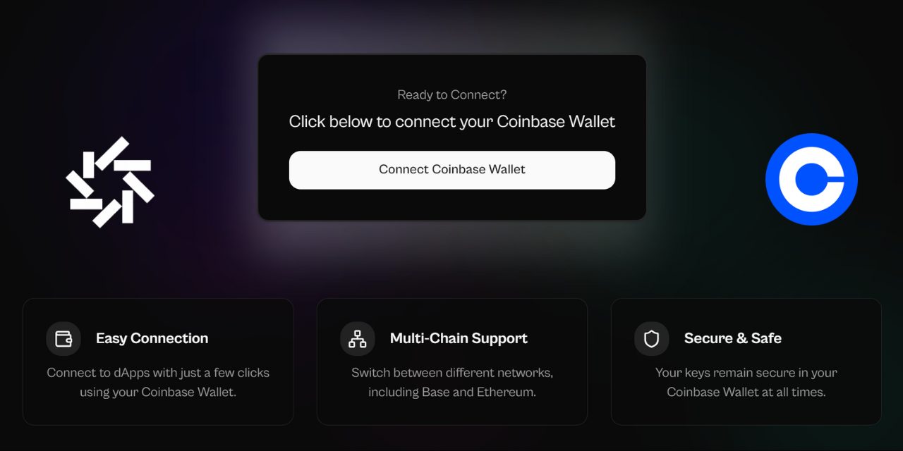

# Sample React Coinbase Connect

A boilerplate for quickly setting up a project with React + Vite + TypeScript + shadcn/ui + CoinBase Wallet SDK. This template saves hours of efforts it would take for a developer to manually set all this up.



---

## 🚀 Getting Started

### Open Using Daytona

1. **Install Daytona**: Follow the [Daytona installation guide](https://www.daytona.io/docs/installation/installation/).
2. **Create the Workspace**:
   ```bash
   daytona create https://github.com/daytonaio/sample-react-coinbase-connect
   ```
3. **Start the Application**:

   ```bash
   npm install
   npm run dev

   # Building for Production
   npm run build
   npm run preview
   ```

---

## ✨ Features

- [x] CoinBase Wallet integration
- [x] Modern UI with shadcn/ui components
- [x] Built with Vite for fast development
- [x] Type-safe with TypeScript
